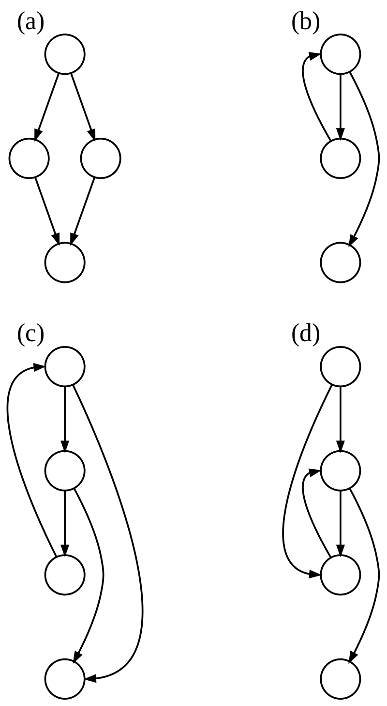

# Niche programming languages

-	**Make**	: 	builds executable programs

-	**XSLT**	: 	"Extensible Stylesheet Language Transformations", transforms XML documents into other XML documents

-	**Inform**	:	based on English language, supports creating interactive text-based fiction.

-	**YAML**	:	a human readable data serialization language. minimal and concise.

-	**ANTLR**	:	"Another tool for language recognition", takes input grammar, outputs language recognizer code in many programming languages.

-	**CFML**	:	a scripting language for web development that augments HTML with database_commands/functions/conditional operators.

-	**SWIG**	:	a software development tool that connects programs written in C and C++ with a variety of high-level programming languages. 
SWIG is typically used to parse C/C++ interfaces and generate the 'glue code' required for the above target languages to call into the C/C++ code.

-	**IDL**	:	Interactive data language, used for data analysis, particularly in astronomy, atmosphere physics and medical imaging.
Fast at vector operations, dynamically typed and uses passing by reference almost all the time.
  
-	**Dart**	:	Another general purpose PL developed by google. Usually compiled to JavaScript.

-	**Jinja2**	:	A web template engine for Python, similar to Django. Has python code written within HTML.

-	**CSS**	:	Cascading style sheets, describes the presentation of a document written in markup language(HTML).
cornerstone to the Web, alongside HTML and JavaScript.

-	**SCSS**	:	Sassy CSS, or sass. Interpreted or compiled into CSS.

-	**Markdown**:	A light-weight markup language for creating formatted text in a plain text editor.

-	**Emacs Lisp**:	A dialect of LISP, it is used as a scripting language by the EMACS text editors. 

-	**INI**	:	A configuration file extension for computer software, it consists of key-value pairs.
Popularized by MSDOS.

- **JSON** : "JavaScript object notation", a standard file format and data exchange format, that stores data objects as attribute-value pairs // array data types, and is human and machine readable.
  
- **Vim script** : A scripting language built into the Vim text editor, that is used to write most plugins for Vim.

- **Lex** 		: A computer program that generates lexical analyzers. It reads an input stream specifying the lexical analyzer, and outputs the code that actually does the analysis.

- **Sed**			: "Stream editor" a Unix utility that parses and transforms text using a simple language.
Uses a regex input, it can filter/replace string patterns on a line-by-line basis.  

- **Bash**		: A unix shell and command line language written for the GNU project, used by default for most Linux distributions.  
It typically runs in a text window, where user types in commands, or it can read and execute commands from a file.
 
- **Batch**	: A scripting file that contains a series of Windows commands, alongside branching/looping logic.

- **Mustache** : A web template system, available for many programming languages, and used for web and mobile applications.  
It is logic-less, and all the control is driven by data.  

- **AWK**		: A data-driven scripting language, designed for test processing (like Sed and Grep), and typically used for data extraction and reporting, and is a standard part of Unix-like operating systems.  

- **HTML**	: "Hyper-text markup language", the standard markup language for documents designed to be displayed on the WEB. It can be assisted by CSS (which defines the layout) and JavaScript (whose content can be embedded within an HTML document, and affects its behavior and content).  
Browsers receive an HTML document, that describes the structure of a web page, and render them for display.

- **Scsh** 	: "Scheme shell", a portable operating system interface, layered on scheme (a dialect of LISP). Mostly outdated.

- **XML** 	: "Extensible Markup language", a language for encoding documents in a human and machine readable format. Widely used for representing arbitrary data structures on the internet.  

- **YACC**	: "Yet another compiler-compiler" A look ahead left-to-right parser generator, that generates a parser based on the formal grammar.

- 

# General-purpose Programming Languages

-	**COBOL** :	“common business-oriented language”, a compiled, imperative English-like PL designed for business use.
created in 1959 by Mrs. Grace Hopper, it is a mostly retired language.  

- **LISP**: 

- **Lua**:

- **Go**:  

# Other Trivia

- **Control flow graph** :	A representation, using graph notation, of all the paths that may be traversed through a program during its execution.  

- **Static single assignment form** : A property of an IR (intermediate representation) that requires each variable to assigned only once. Existing variables are split into versions, with different subscripts.  

> y := 1  
	y := 2  
	x := y  

	-- Transforms into --  
> y1 := 1  
	y2 := 2  
	x1 := y2  

multiple other compiler optimizations can be enabled/enhanced using SSA.

- **Continuation passing style** : A function written in continuation-passing style takes an extra argument: an explicit "continuation", i.e. a function of one argument. When the CPS function has computed its result value, it "returns" it by calling the continuation function with this value as the argument.

- **Three address code** : (TAC) (3AC) intermediate code used by compilers, to aid with implementing optimizations.  
Each TAC instruction has at most 3 operands.

> x = (-b + sqrt(b^2 - 4*a*c)) / (2*a)  

	-- Transforms into --  

> t1 := b * b  
t2 := 4 * a  
t3 := t2 * c  
t4 := t1 - t3  
t5 := sqrt(t4)  
t6 := 0 - b  
t7 := t5 + t6  
t8 := 2 * a  
t9 := t7 / t8  
x := t9  

and 
> for (i = 0; i < 10; ++i) {
    b[i] = i*i; 
}

	-- Transforms into --  
>&nbsp;&nbsp;&nbsp;&nbsp;&nbsp;&nbsp; t1 := 0                ; initialize i  
L1:  if t1 >= 10 goto L2  conditional jump  

&nbsp;&nbsp;&nbsp;&nbsp;&nbsp;&nbsp;t2 := t1 * t1          ; square of i  
&nbsp;&nbsp;&nbsp;&nbsp;&nbsp;&nbsp;t3 := t1 * 4           ; word-align address  
&nbsp;&nbsp;&nbsp;&nbsp;&nbsp;&nbsp;t4 := b + t3           ; address to store i*i  
&nbsp;&nbsp;&nbsp;&nbsp;&nbsp;&nbsp;*t4 := t2              ; store through pointer  
&nbsp;&nbsp;&nbsp;&nbsp;&nbsp;&nbsp;t1 := t1 + 1           ; increase i  
&nbsp;&nbsp;&nbsp;&nbsp;&nbsp;&nbsp;goto L1                ; repeat loop  
L2:

- **GCC** : (GNU Compiler Collection) An optimizing project provided by GNU that supports multiple programming languages, hardware architectures and operating systems.  
One of the biggest open source codes in history.

- **Register Transfer language** (RTL) An intermediate representation that is very close to the assembly language. Like an architecture-neutral assembly language.