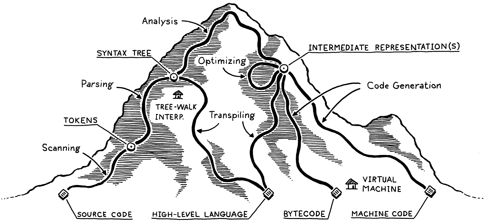

# A map of the territory

- The way we build programming languages is virtually unchanged. Though the area explored by language designers is vast, the trails they have carved through it are few.

 
### 1. Scanning (Lexing)    
- Takes in the linear stream of characters and chunks them together into a series of something more akin to words, or **tokens**, that vary in length.  
- The scanner discards comments/white spaces, and leaves a sequence of meaningful tokens.

### 2. Parsing
- Where we get a grammar, or the ability to compose larger expressions and statements out of smaller parts.    
- Takes a flat sequence of tokens, and builds the nested tree structure of grammar, a **parse tree**, or an **abstract syntax tree**.  
- Many of the techniques used today to parse programming languages were originally conceived to parse human languages by AI researchers who were trying to get computers to talk to us.
It turns out human languages were too messy for the rigid grammars those parsers could handle.  
- The parser reports when there is a syntax error.

### 3. Static Analysis
- Where the individual characteristics of each language start to come into play. At its beginning, we know the syntactic structure of the code (e.g. "a + b" means add "a" and "b"), but nothing more.  
- The first bit of analysis - **Binding**, or **Resolution** - is where we find out where each **identifier** is defined.   
	
- The **Scope**, is the region within a source code where a certain name can be used to refer to a certain declaration.
	
- For a statically typed language, we can figure out the types of "a" and "b", and we can throw a type error if the types don't support being added to each other.
	A dynamically typed language does such check at runtime.
	
>- With all this information we have, we can:  
	  1- Store it as attributes on the syntax tree itself.  
	  2- Store it in a lookup table to the side, a **Symbol Table**. the keys to this table are the identifiers, and the values are what the identifier refers to.  
	  3- Transform the tree into an entirely new data structure, which more directly describes the semantics of the code.
	
- This is the end of the **Front end** of the language implementation. Now we move on to the **Middle End** (a paradoxical name), and the **Back End**.
	
### 4. Intermediate representations
- a representation that is not tied to either the source (programming language) or the destination (target platform).
- Reduces the code needed to be written, with a single front end for each programming language, and a single back end for each target platform.

### 5. Optimization
- To replace the user's program with a more efficient one, that has the same semantics, and does the same functionality but more efficiently.  
	e.g. **Constant folding** , where the compiler evaluates a constant expressions at compile time.

### 6. Code generation
- The back end of a compiler. “code” here usually refers to the kind of primitive assembly-like instructions a CPU runs. from here on, everything becomes more primitive.    

- We can generate code for a real CPU, as in, we get code that the OS can load directly onto the chip. It is fast, but generating it is difficult, and ties the compiler to a specific architecture.   
- Compilers can also generate virtual machine code. code for  a hypothetical idealized machine. it is called **p-code**, or **bytecode**, because each instruction is usually a single byte long. They are more tied to the language's semantics, and less to the specifics of a certain architecture.  

### 7. Virtual machine
- After bytecode is produced, you can either write a mini-compiler for each architecture, or you can write a **virtual machine**.
- A virtual machine is a program that emulates a hypothetical chip supporting your virtual architecture at runtime. This is much slower at runtime than translating to native code beforehand, but it is simple and portable.  
e.g. if you implement the VM in C, then you can run your language on any platform that has a C compiler. This is how the second interpreter in the book works.

### 8. Runtime
- Our language needs to provide some services while the program is running. e.g. Garbage collector,  or tracking the type of each object during execution.  
- The code implementing the runtime is usually inserted directly into the resulting executable, or it lives within the VM.

******

# Shortcuts and alternate paths

### 1. Single-pass compilers 

- They interleave parsing, analysis and code generation, producing output code directly in the parser.  
- They restrict the design of the language. You do not store any global info, or visit any previous part of the code. 
- Pascal and C were designed this way. That's why in C you can't call a function above the code that defines it, unless you have a forward declaration.  

### 2. Tree-walk interpreters

- Some compilers execute the code right after parsing it. To run the program, the interpreter traverses the syntax tree. These are called **Tree-walk interpreters**.
- Common for student projects, and little languages, but it is slow.
- Our first interpreter works this way.

### 3. Transpilers

- We can treat some other source language as our intermediate representation, just producing the source code of another high-level programming language. This is called a source-to-source compiler, a **Transcompiler**, or a **Transpiler**.
- Many languages just compiled to C in the early Unix era. Since web browsers are machines whose machine code is JavaScript, almost all languages now have a compiler that targets JS.
- The front end of the Transpiler is regular. Then if the source language is a "syntactic-skin" over the target, we can directly output analogous syntax. Else, we do some analysis/optimization, and then generate the target language.
- Then we just run the resulting code through that language's existing compilation pipeline.

### 4. Just-In-Time compilation

- Done by *JVM* (HotSpot Java virtual machine), *CLR* (Microsoft's common language runtime) and most *JavaScript* interpreters.
- When the program is loaded on the end-user's machine, either source-code (*JS*), or bytecode (*JVM* and *CLR*), you compile it to the native architecture.
- Some *JITs* insert profiling hooks into the generated code, see the performance critical regions, and automatically recompile those "hot spots"with more advanced optimization.

# Compilers and Interpreters

- A **Compiler** transforms source code into some other form (usually lower-level), without execution.
- An **Interpreter** takes source code and executes it immediately.

------------------------
# Challenges

> 1- Pick an open source implementation of a language you like. 

- [Roslyn](https://github.com/dotnet/roslyn) is the open source compiler for C#, and a part of the dotnet platform. In it, there are many tools, giving access for software developers for things that only a compiler knows.
- There are many grammar implementations for C# in Lex and Yacc, many in other languages as well. but I would use the [ANTLR implementation](https://github.com/antlr/grammars-v4/tree/master/csharp) 